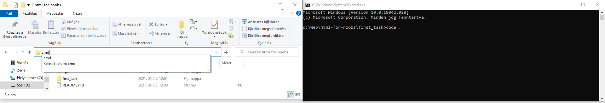

# Feladat1 - Alap html

Ebben a feladatban felsetupolod a Git-et, VS Code-ot, majd egy alap html dokumentum strukturáját készíted el.  
A végén szakszerűen felrakjátok githubra, command line-ból.

## A VS Code

Ez egy windóz only guide.  
Első lépés letölteni, felrakni. Wow.

Az legfontosabb dolog, hogy ne egy-egy file-t, például az index.html-t nyisd meg, hanem az **egész mappát**, amibe van (htmlfornoobs/first_task).  
Így gyorsan át tudsz váltani a projekt file-jai között itt az explorerbe, nem kell nyitogatni meg ilyenek.  
Viszont ami miatt elsődleges prioritás, az a terminal használat. Később kitérek majd rá.

Hogy ke' mappát megnyitni? File -> Open Folder -> kiválasztod a mappát.  
Ha épp az intézőben abban a mappában vagy, amit meg fogsz nyitni, akkor van egy gyors módszer.  
Belekattintasz az elérési útba, és helyére beírod, hogy cmd. Ekkor megnyitja a cmd-t, a mappán belül navigálva.  
A `code` parancs megnyitja a programot. A `.` pedig a mappa relatív elérési útja, tehát saját maga.  
Tehát ha mondjuk a html-for-noobs mappából akarnánk megnyitni a first_task mappát, akkor a parancs `code ./first_task` lenne.  

Jó, megnyílt a mappa. Szép munka! Már csak le kell szedned a file-okat és mehet a kódolás, azonban a VSCode erőssége az extensionokben (is) rejlik.  
Az extensions ablakot itt balra is megnyithatod az ikonnal, vagy felül View -> Extensions  
Leírom, amiket én használok, ezek optional, de strongly recommended.

> **Auto Rename Tag** - ha mondjuk egy `<h2>...</h2>`-t `<h1>...</h1>`-re akarsz cserélni, ezzel elég csak az egyik taget átírni, a másikat automatiusan megváltoztatja.
>
> **Live Server** - Nem kell frissítgetni a böngésző oldalt, mentéskor automatikusan megjelennek a változtatások.
>
> **Prettier** - Automatikusan megformázza a kódod mentéskor. Ez a legjobb dolog a világon.

## A Git

Egy verziókezelő rendszer, olvass utána, ide csak annyit írok le hogy kell felrakni a megoldást.

A command lineban ahová le akarod tölteni a mappát: `git pull https://github.com/tralk331/html-for-noobs`

Ezt követően csinálj egy új branch-et a neveddel, és váltsd rá át: `git checkout -b branchnév`

Ha kész teljesen, vagy csak egy része, hozzá kell adnod a file-okat, amit fel akarsz rakni, ez most minden file: `git add .`

Ezt követően commit-elni a változtatásokat `git commit -a -m "commit message arról, hogy mit műveltél"`

Majd fel kell töltened githubra: `git push origin branchneve`

## A feladat

Készítsd el Józsi virágoskertjének oldalát. Ebbe a mappába hozd létre az index.html file-t. Az alaphoz használd a vs-code-ba beépített ! + enter snippetet.  
A böngésző lapján megjelenő szöveg: József Virágos kertje  
Az oldal tartalmazzon egy header-t, benne egy 1-es szintű címsorral és a virag2.jpg képpel. A kép hossza legyen 100%, a magassága 200px.  
Legyen egy navigációs menü. Alakíts ki egy számozatlan felsorolást ami a "nav-list" class-t kapja, míg az elemei a "nav-item" class-t.  
Az alábbi elemek legyenek benne: "Rólam", "Kedvenceim", "Árak". A naviációt linkek végzik, amelyek a megfelelő szekció id-jére mutatnak, pl : Rólam menüpontnál a href: #rolam  
A main-en belül legyen három szekció, amelyek megkapják a navigáció működéséhez megfelelő azonosítókat: rolam, kedvenceim, arak.  
A szekciókban a címsorok 2-es szintűek.  
A rólam szekcióban alakítsd ki a bekezdéseket a "html-kesz-nocss" kép szerint, majd adj hozzá még egy bekezést, ami legalább 100 szavas lorem ipsumot tartalmaz. vscode snippet: lorem100 + enter  
A kedvenc virágaim szekcióban alakítsd ki a számozott felsorolást. Az alatta lévő címsor 3-as szintű. A címsor alatt készíts egy div-et "flower-pictures" class-al, amibe a 3 virághoz tartozó kép kerül.  
A képek 200px hosszúak és 150px magasak.
Az árak részben a címsor alatt az ár kártyák egy "price-cards" osztályú divben vannak, míg a kártyák a "card" osztályt kapják.  
A kátyán belül a virág neve egyes szintű címsor, az ár pedig `span` tag-en belül van.  
Ha úgy néz ki, mint a nocss képen, akkor fasza, mostmár hozzákapcsolhatod a css-t.  
Ha ezután úgy néz ki mint a kész képen, akkor perfect, ha nem, akkor a struktúrával, classok, id-k elnevezésével lehet baj. Próbálj meg a css-ből rájönni, hogy mi nem ugyan olyan.
